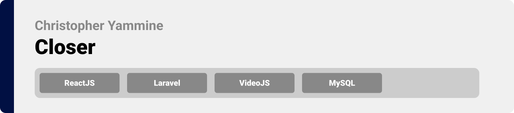
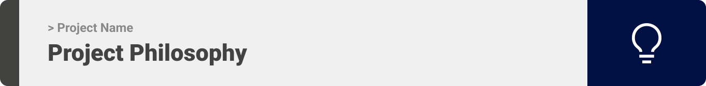
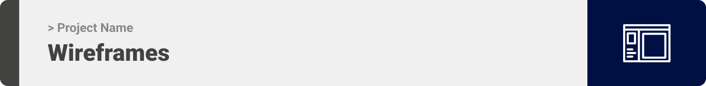
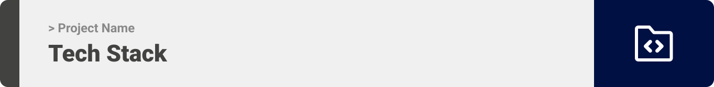
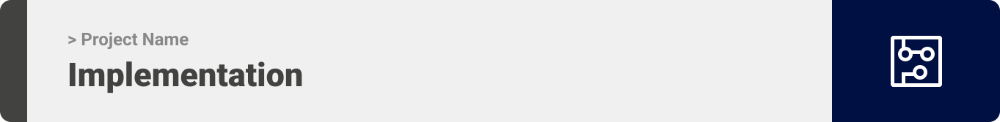
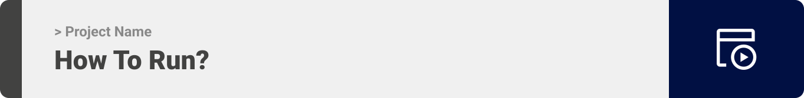

> Hello world! This is the project’s summary that describes the project plain and simple, limited to the space available. 


**[PROJECT PHILOSOPHY](https://github.com/Christopher-Yammine/readme-demo#-project-philosophy) • [WIREFRAMES](https://github.com/Christopher-Yammine/readme-demo#-wireframes) • [TECH STACK](https://github.com/Christopher-Yammine/readme-demo#-tech-stack) • [IMPLEMENTATION](https://github.com/Christopher-Yammine/readme-demo#-impplementation) • [HOW TO RUN?](https://github.com/Christopher-Yammine/readme-demo#-how-to-run)**

  

> The Well app is a mental health and mindfulness app built on top of the science of positive psychology. The Well app is more than just another meditation or journaling app; it encourages you to enhance and reflect on your day with structured, guided activities.
> 
> There are 5 daily tasks that the Well app asks you to complete each day: record 3 gratitudes, write a journal entry, perform 3 acts of kindness, exercise for 20 minutes, and meditate for 15 minutes.

### User Stories
- As a user, I want to browsse ablums, so that I can find quick links
- As a user, I want to browsse ablums, so that I can find quick links
- As a user, I want to browsse ablums, so that I can find quick links

  

> This design was planned before on paper, then moved to Figma app for the fine details.
Note that i didn't use any styling library or theme, all from scratch and using pure css modules

  

  

> Uing the above mentioned tecch stacks and the wireframes build with figma from the user sotries we have, the implementation of the app is shown as below, these are screenshots from the real app

  

> This is an example of how you may give instructions on setting up your project locally.
To get a local copy up and running follow these simple example steps.

### Prerequisites

### Installation

_Below is an example of how you can instruct your audience on installing and setting up your app. This template doesn't rely on any external dependencies or services._

